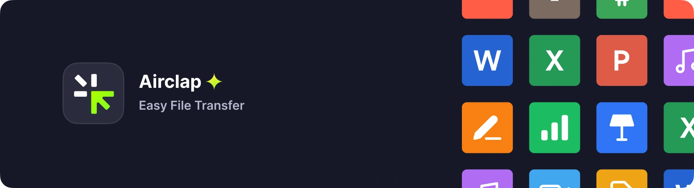

[English](https://github.com/Gentleflow/Airclap/blob/main/docs/README.md) / [繁体中文](https://github.com/Gentleflow/Airclap/blob/main/docs/README-TC.md) / [简体中文](https://github.com/Gentleflow/Airclap/blob/main/docs/README-SC.md) / [日本語](https://github.com/Gentleflow/Airclap/blob/main/docs/README-JP.md) / [한국어](https://github.com/Gentleflow/Airclap/blob/main/docs/README-KO.md)     

# Airclap
모든 장치에 모든 파일 전송 - 사용자 친화적이고, 크로스 플랫폼이며, 매우 빠르고, 아름답게 디자인된 최고의 파일 전송 도구입니다.

## 홈페이지
[airclap.app](https://airclap.app)

## 다운로드
| 플랫폼 | 패키지 및 앱 스토어                                                                                                                                                                                                                                                                                                                                                                                                                                                  |
|:--|:-------------------------------------------------------------------------------------------------------------------------------------------------------------------------------------------------------------------------------------------------------------------------------------------------------------------------------------------------------------------------------------------------------------------------------------------------------------|
| macOS |                                                                                                                                                          |
| Windows |       |
| iOS  |                                                                                                                                                                                                                                                                                                                              |
| Android |                                                                                                                                                                                                                                                                                                          |

## 스크린샷

## 하이라이트
#### 🌎 &nbsp; 인터넷 필요 없음
- 무선 전송
- 주변 공유 
#### 🖥️ &nbsp; 다양한 플랫폼 간 교차
- Mac, iOS, Windows, Android 지원
- airclap.app 또는 앱 스토어에서 빠르게 설치하세요
#### 🔮 &nbsp; 모르덴 사용자 인터페이스
- 간소화되고 사용자 친화적인 전송 환경
- 명확하고 직관적인 피드백
#### ⚡️ &nbsp; 초고속 전송 속도
- 로컬 네트워크에서 사용 가능한 최대 전송 속도
- 매우 안정적인 전송 프로세스
- 실시간 상태
#### 📃 &nbsp; 선명도 파일 레코드
- 풍부한 바로 가기
- 선명도 파일 목록 및 미리보기 썸네일

### 감사

이러한 오픈소스 라이브러리 덕분에 에어클랩의 탄생이 가능했습니다:

- [Flutter](https://flutter.dev/)
- [Flutter Candies - Flutter Plugins](https://github.com/fluttercandies)
- [Flutter Community - Flutter Plugins](https://github.com/fluttercommunity)
- [LeanFlutter - Flutter Desktop Plugins](https://github.com/leanflutter)
- ……

### 지원 및 피드백
[airclap.canny.io](https://airclap.canny.io/feedback)
